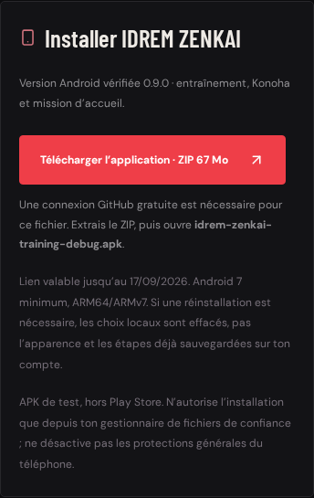
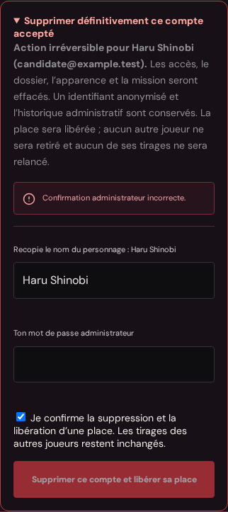

# Ajouts demandés : suppression de compte, téléchargement et musique

**Lot 0.10 compilé : site testé localement, musique importée et cycle de lecture contrôlé dans Godot. Le propriétaire confirme ensuite le fonctionnement de 0.10 sur son téléphone.** Le propriétaire confirme le bon fonctionnement du lot 0.9, puis demande ces trois ajouts en parallèle de la préparation du multijoueur. Aucun nouveau téléchargement Android imposé à chaque tâche.

## Supprimer un compte accepté

Dans **Administration → dossier d’un joueur accepté → Supprimer définitivement ce compte accepté** : recopie du nom exact, mot de passe actuel de l’administrateur et case explicite de libération de place. Rien ne se produit à l’ouverture du dossier. L’administrateur ne peut pas se supprimer, ni supprimer un autre type de compte par cette route.

`POST /api/admin/accounts/:id/delete` vérifie le propriétaire connecté, son mot de passe, sa session encore valide dans la transaction et la confirmation exacte. Le mot de passe ne quitte pas le flux HTTPS et n’est pas stocké côté navigateur ; il est vidé du formulaire après envoi. La limite des opérations sensibles et le contrôle d’origine s’appliquent.

La suppression révoque les sessions site/jeu et les jetons de récupération, efface la candidature, l’apparence, la mission et l’attribution du compte. Elle libère **une seule place** pour une future admission manuelle. Les inscriptions en attente ne sont pas admises automatiquement. Un identifiant utilisateur **anonymisé et inutilisable**, un marqueur de suppression et l’audit administratif restent conservés : ce n’est pas une promesse d’effacement intégral de toute trace historique. Aucun mécanisme de restauration n’est proposé.

Les mutations concurrentes sont sérialisées par les transactions/verrou PostgreSQL existants. Une deuxième soumission identique ne supprime rien de plus. Une connexion validée juste avant une suppression est recontrôlée sous verrou avant de créer une session. L’application Android solo déjà ouverte peut rester visible, mais ses prochains appels authentifiés sont refusés ; aucune commande n’efface à distance un APK déjà installé.

### Places et potentiels

La table additive `allocation_seats` relie chaque attribution à une des vingt places du paquet `mokuton_slots`. Les anciennes attributions sont rattachées à une place de **même potentiel**, sans modifier clan, affinité ou Mokuton. Une incohérence bloque la migration plutôt que modifier des tirages.

Une suppression libère la place correspondante ; une nouvelle admission puis attribution utilise une place libre. Ainsi une cohorte de vingt attributions actives garde **exactement trois potentiels Mokuton**, même après remplacement, et les plafonds de trois membres par clan rare restent appliqués. Aucun bouton de reroll pour les comptes conservés. Le tirage d’un éventuel nouveau compte reste soumis à une nouvelle admission manuelle ; les autres résultats sont inchangés.

## Télécharger depuis l’espace joueur

Le panneau **Installer IDREM ZENKAI** n’apparaît que pour un compte accepté. `GET /api/game-download` recontrôle la session et l’admission au moment du clic ; ni l’administrateur ni un candidat en attente ne peut utiliser cette route. Les réponses sont non mises en cache.

Le panneau pointe actuellement vers **l’APK 0.10 vérifié**, incluant la musique : ZIP d’environ 68 Mo, nom de l’APK, instructions d’extraction et limites de réinstallation. La connexion GitHub est nécessaire pour ce stockage temporaire, signalée avant le clic. Après l’expiration du **18 septembre 2026 à 12:57:34 UTC**, le bouton est retiré et la route renvoie 410 au lieu de rediriger vers un fichier périmé. Métadonnées actualisées dans `server/android-build.js` uniquement après compilation réussie.

Il s’agit d’un **contrôle d’accès à la distribution sur le site**, pas d’un DRM : un joueur peut partager un fichier déjà téléchargé, et le lien GitHub ne possède pas une autorisation liée au compte du site. Le jeu connecté continue de vérifier l’admission. Aucun compte GitHub ni secret de service n’est créé sur Render.

## Musique fournie pour le village

Fichier trouvé sur `main` : **`1001641947.mp3`**, commit `982ec60084c88b8cda263a207c2eb79fa1c289c6`. Son contenu est en réalité de l’AAC dans un conteneur MP4, mono 48 kHz, environ 78,15 secondes. Original conservé hors export dans `game/audio_sources/village_loop.mp3`.

Dérivé Vorbis mono 22 050 Hz : **458 803 octets**, environ **78,13 s** conservées, niveau harmonisé et petits fondus de boucle, sans changer la hauteur ni le tempo. Génération FFmpeg 7.0.2 reproductible et vérifiée par hachage. Pas de nouvelle musique générée ni d’écoute humaine prétendue. [Manifeste et préparation](../game/assets/village_audio/README.md).

Un seul lecteur est rattaché à Konoha. Il respecte le volume général existant, joue doucement en boucle et propose **MUSIQUE : OUI/NON**. Perte de focus → pause ; retour → reprise ; sortie de Konoha → arrêt immédiat. La musique et les effets de combat restent inchangés.

## Validation réelle et état de livraison

- **31 tests Node**, **9 tests PostgreSQL jetable**, dont suppression/replacement concurrent sur deux pools, et Vite réussis.
- **2 parcours Playwright Chromium réussis**, incluant les écrans mobiles, téléchargement accepté, confirmation erronée, mot de passe vidé, suppression d’un compte fictif et refus de son ancienne session. Captures mobiles inspectées et conservées ci-dessous. Aucun compte réel supprimé.
- Tests de musique ajoutés à Godot : boucle distincte, volume général, absence de chevauchement du combat, commande tactile, focus et arrêt à la sortie. Analyse GDScript sans nouvelle erreur (l’avertissement tiers historique de géométrie 0.8 demeure). **238 assertions Godot passent**, dont les sept vérifications musicales. Fonctionnement sur téléphone ensuite confirmé par le propriétaire ; pilote audio Dummy pendant les tests automatisés.
- **Aucun déploiement Render effectué par l’agent.** Pour activer les ajouts du site : service existant, branche `arena/01a08158-matchly-project`, Manual Deploy → Deploy latest commit. Migrations additives au démarrage, aucun nouveau secret. Les textes de confirmation exposent la libération de place avant toute action.
- **Le lot réseau suivant est en validation des sources** ([état détaillé](VILLAGE_PARTAGE.md)). Il n’est pas inclus dans l’APK 0.10, et son exécution moteur n’est pas encore annoncée comme testée. Les trois ajouts sont regroupés dans un seul APK 0.10 ; aucun APK par petite tâche.

## Version regroupée vérifiée

- [Exécution 34601493231](https://github.com/Zorolefrerot/MATCHLY-PROJECT/actions/runs/34601493231), source `33fb9ac7d8aa152373be0fa7dca2711749132456`, Godot 4.5.1, version **0.10.0/code 10**.
- [ZIP `idrem-zenkai-android-19`](https://github.com/Zorolefrerot/MATCHLY-PROJECT/actions/runs/34601493231/artifacts/10264293080), **67 529 246 octets**, disponible jusqu’au **18 septembre 2026**. APK à l’intérieur : `idrem-zenkai-training-debug.apk`. Le fichier de journaux n’est pas l’installateur.
- **31 tests Node, 9 tests PostgreSQL, 2 parcours Playwright, 238 assertions Godot**, Vite, signature Android, permissions et captures réussis. Arrivée avec commande musicale et journal inspectés sur captures ordinateur ; capture mobile du téléchargement actualisé 0.10 également inspectée.
- Le décodage du Vorbis final confirme **78,13265 s**, pic **0,58483**, RMS **0,08104**, écart entre dernier et premier échantillons **0,0000764**. Ce sont des mesures du signal, pas une écoute ni un benchmark du téléphone.
- [Empreintes et détails de validation](../game/VALIDATION.md).

