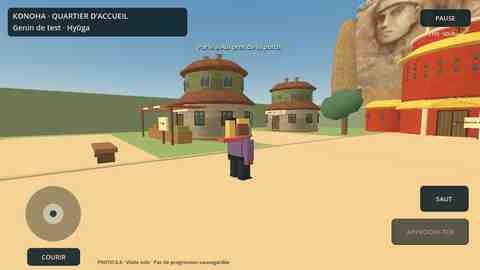

# Konoha — quartier solo et rendu amélioré, version 0.9

**APK 0.9 compilée, tests moteur et captures du journal vérifiés.** Le propriétaire a approuvé le quartier 0.7 puis demandé un décor moins cubique (0.8). Le lot 0.9 regroupe ensuite mission d’accueil, journal et sauvegarde sur compte. **Déploiement Render 0.9 et essai sur son téléphone encore à faire.**

## Version 0.10 — musique de fond

La musique fournie est maintenant incluse, en boucle et à volume de fond, avec commande **MUSIQUE : OUI/NON**. Pause en arrière-plan et arrêt en quittant Konoha vérifiés dans le moteur ; fonctionnement de 0.10 ensuite confirmé par le propriétaire sur téléphone. Le quartier et la mission 0.9 restent conservés. [APK regroupé 0.10 et ajouts du site](AJOUTS_SITE_MUSIQUE.md).

## Mission d’accueil 0.9

Parler à Aoi et accepter la mission, lire/valider les panneaux de l’académie, du marché et de la résidence, puis revenir lui remettre son rapport. **JOURNAL** indique les étapes réellement confirmées sur le compte. Coupure ou conflit : actualiser, sans cocher une étape non confirmée. [Contrat, limites et téléchargement du lot](MISSION_ACCUEIL.md).

## Accès

1. Dans l’APK **0.10**, ouvrir **MON COMPTE** et se connecter avec son compte joueur admis.
2. Appuyer sur **ENTRER À KONOHA · PREMIÈRE ZONE SOLO**. Le serveur est interrogé à nouveau pour vérifier la session/admission et récupérer la dernière apparence sauvegardée.

**Mettre à jour le service Render existant avant de tester la mission** : Manual Deploy → Deploy latest commit, puis attendre Live. Même API de compte avec champ mission additionnel et route d’événements, migration additive automatique, sans nouveau secret. Sur un ancien serveur, seule l’exploration reste disponible. Le compte administrateur demeure distinct ; ses fonctions initiales de Hokage/chef de l’Akatsuki ne sont pas ajoutées à ce lot.

## Ce qui est jouable

- Quartier d’accueil d’environ 58 × 66 mètres, avec une porte au sud, une allée centrale et des rues transversales.
- Maisons à étages arrondis et toits courbes, étals du marché, extérieur de l’académie, résidence rouge et or au nord ; arbres, bancs et panneaux. Monument à quatre visages en décor texturé derrière des volumes de rochers.
- Personnage portant **l’apparence enregistrée sur le compte**, avec son nom et son clan affichés. À défaut d’apparence distante, utilisation du modèle par défaut ; aucun import automatique du personnage d’entraînement.
- Marche, course, saut, joystick et caméra au doigt ; clavier ZQSD/WASD, Maj, Espace et **E** pour interagir. Pas de frappe/jutsu dans ce quartier pour le moment.
- **Aoi**, PNJ d’accueil original près de l’arrivée : s’approcher puis **PARLER À AOI**. Dialogue écrit, sans IA externe.
- Trois panneaux à lire : marché, académie, résidence du Hokage. Les lectures sont sauvegardées après acceptation de la mission et confirmation du serveur ; Aoi reçoit ensuite le rapport.
- Pause et dialogues arrêtent les déplacements. Perte de focus → pause ; bouton Retour Android → pause/reprise. **RETOUR À MON COMPTE** quitte la visite sans lancer l’entraînement.

## Remaniement visuel 0.8

Les trois images fournies guident les formes, couleurs et détails. Les anciens cubes des maisons sont remplacés par des volumes elliptiques à étages en retrait ; les colliders suivent les nouveaux murs. La résidence reçoit un corps rouge, des ailes basses, des toits dorés et un porche. Sept textures de 256² ou 512² sont partagées ; toutes les fenêtres, portes et l’emblème sont regroupés dans un seul maillage.

Le monument utilise les **quatre premiers visages** pour correspondre à l’image de la résidence. Ce choix n’impose pas une nouvelle époque au scénario ; l’image complète à sept visages reste dans le dépôt. Les visages sont une **image texturée fixe**, pas des sculptures 3D. Les sources petites limitent leur définition. [Préparation, provenance et droits non vérifiés](../game/assets/konoha/README.md).

## Limites explicites

- C’est une **visite solo**, pas encore un village partagé : aucun autre joueur, chat réseau ou synchronisation des positions.
- Bâtiments visibles de l’extérieur uniquement ; portes fermées, pas d’intérieurs, boutique, inventaire ou mission rémunérée.
- Le repérage n’accorde aucun objet, ryō, expérience, rang ou pouvoir. La position n’est pas sauvegardée : une nouvelle visite repart de l’entrée. Les étapes confirmées de la mission, elles, sont rechargées depuis le compte.
- L’admission est vérifiée à l’entrée, à l’actualisation du journal et lors de chaque écriture de mission, pas surveillée en continu. Aucun appel réseau périodique pendant la marche.
- Géométrie et personnages procéduraux provisoires, pas une reconstitution complète/définitive de Konoha. Musique de village fournie ajoutée en 0.10 ; les sons de combat restent conservés et séparés dans l’entraînement.

## Isolation technique et performances

- Scène `game/scenes/konoha.tscn`, scripts `konoha_map.gd`, `konoha_architecture.gd`, `konoha_visit.gd`, `konoha_hud.gd`.
- `SubViewport` et `World3D` propres à la visite. Le contrôleur tactile testé de l’entraînement est réutilisé, sans son interface de combat.
- Pendant la visite, le nœud d’entraînement est désactivé, ses entrées sont désactivées et le rendu 3D du viewport racine est coupé. Le monde Konoha continue seul ; pas de double rendu des deux cartes.
- La fermeture arrête le rendu du viewport de visite, détruit ses nœuds, restaure le traitement de l’entraînement et revient au compte en pause. Les règles, la position, les recharges et l’apparence locale de l’entraînement ne sont pas modifiées par l’exploration.
- Collisions des murs, bâtiments, arbres, bancs et étals ; portée et ligne de vue pour interagir. Retour au point d’arrivée si le personnage sort accidentellement des limites ou tombe sous le sol.
- Pas d’ombres dynamiques ni de MSAA dans cette première visite. Pas de mesure de FPS Android : le budget réduit ne remplace pas l’essai sur l’appareil réel.

## Vérifications

- **231 assertions Godot** passées, régressions de l’architecture/compte/contrôles conservées, plus mission, accusés serveur, journal borné, panne/conflit, reprise, réponse tardive et expiration.
- **28 tests Node**, **8 tests PostgreSQL** et Vite réussis. Seule la persistance d’accueil est ajoutée côté serveur, sans changement des attributions, de l’apparence, des sons ou du combat.
- Dix-huit captures ordinateur produites. **Journal et incident réseau inspectés** dans Arena ; profils fictifs, pas les identifiants d’un joueur réel. Les images d’arrivée/marché plus haut sont les preuves de rendu 0.8, dont la géométrie est conservée.
- Exécution **34474189586**, source **fc8beb91a2fd9d9a9d085575ad614bf05dd4e41f**, APK **0.9.0/code 9**. Empreintes : [`game/VALIDATION.md`](../game/VALIDATION.md).

## Stockage gratuit de compilation

La suppression de deux APK intermédiaires non livrées (artefacts des exécutions 7 et 8) a été tentée pour libérer du stockage, mais l’intégration GitHub l’a refusée avec **403**. **Aucune suppression par l’agent n’a abouti.** Les deux anciens artefacts ne figurent plus dans la liste consultée après l’apport des images ; leur suppression n’est pas attribuée à l’agent. Les versions livrées n’étaient pas visées. Le stockage restant approche le quota gratuit après cet APK : avant une prochaine compilation, revoir les anciens artefacts ou attendre leur expiration plutôt que multiplier les APK intermédiaires. Pas de modification des budgets ou du moyen de paiement ; rétention des artefacts toujours 7 jours.

Pour le lot 0.9, le propriétaire a confirmé la suppression des anciens artefacts Android **4 et 5**, vérifiée via l’API GitHub. Aucun APK par petite tâche : la première tentative a échoué avant export, puis un seul APK final du lot a été publié.

## Suite 0.11 en validation

Les sources raccordent maintenant la présence partagée, les animations distantes et le chat RP/HRP. Pas encore d’APK réseau vérifiée ni d’essai à deux téléphones ; l’APK 0.10 conserve la visite locale et la mission personnelle. [État et limites](VILLAGE_PARTAGE.md).
