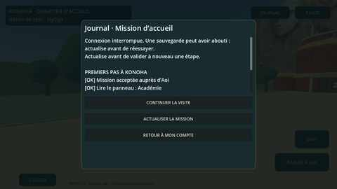

# Lot 0.9 — première mission, journal et sauvegarde

**Lot approuvé par le propriétaire, APK 0.9 compilée et contrôles moteur réussis. Déploiement Render et essai sur téléphone encore à faire.** Le propriétaire demande désormais plusieurs fonctionnalités par lot et une seule installation à la fin, pas une APK pour chaque petite tâche.

## Parcours prévu dans ce lot

1. Entrer à Konoha avec son compte joueur admis. Le profil frais recharge la mission.
2. Parler à Aoi, lire sa proposition puis **ACCEPTER LA MISSION**.
3. Approcher chacun des trois panneaux : académie, marché, résidence du Hokage. Lire puis **VALIDER LA LECTURE**. L’ordre des lieux est libre, mais l’acceptation doit précéder les lectures.
4. Consulter **JOURNAL** : objectifs restants et étapes confirmées. Le texte peut défiler, les boutons restent visibles et les déplacements sont suspendus.
5. Après les trois validations, revenir à Aoi et **REMETTRE MON RAPPORT**. La mission terminée demeure sur le compte, sans redémarrage ni récompense à réclamer.

Les étapes ne sont cochées qu’après la réponse du serveur. Il n’y a **ni ryō, ni expérience, ni objet, ni statistique, ni pouvoir** attribué par ce lot. Les modèles, le combat hors ligne, les sons et les attributions définitives restent distincts. Les intérieurs et le multijoueur ne sont pas ajoutés.

## Persistance et incidents

- Seule la mission est persistée, pas la position, l’orientation de la caméra ou l’exploration libre. Une nouvelle entrée repart de la porte avec les étapes confirmées.
- Après coupure, aucune fausse confirmation locale : le journal affiche l’incertitude et propose **ACTUALISER LA MISSION**. Cette action relit le profil, sans répéter automatiquement une écriture.
- Une écriture peut avoir réussi avant une coupure de réponse. La relecture retrouve alors l’étape ; le serveur accepte aussi un événement déjà enregistré sans l’appliquer deux fois.
- Un conflit nécessite une actualisation avant une nouvelle validation. Pas d’écrasement silencieux, de fusion d’un état envoyé par le client ou de sauvegarde locale présentée comme cloud.
- Session expirée/admission retirée : écriture refusée, retour au compte pour reconnexion. Quitter la visite pendant une requête ne rouvre pas la scène ; la réponse appartient au client de compte, dont la prochaine entrée relira l’état.
- Une désinstallation n’efface pas les étapes **déjà confirmées sur le compte**. Une action non envoyée ou non confirmée doit être vérifiée après reconnexion ; aucun outbox secret sur disque.
- Serveur ancien : compte et exploration restent utilisables, mais le journal indique que les missions requièrent une mise à jour. Aucune fausse mission enregistrée dans ce mode.

## Contrat serveur, version 1

Le protocole de profil existant reste `1`, avec un champ additionnel `welcomeMission`. L’ancien APK peut l’ignorer. La révision d’apparence reste indépendante.

```json
{
  "schemaVersion": 1,
  "missionId": "konoha_welcome",
  "status": "active",
  "visited": ["academy", "market"],
  "revision": 3
}
```

- États : `available` (révision 0, aucune ligne créée par lecture), `active` (révision 1 + nombre de panneaux), `completed` (les trois panneaux, révision 5).
- `POST /api/game/missions/welcome/events`, bearer natif existant ; corps exact `{"event":"read_market","expectedRevision":1}`.
- Événements autorisés : `accept`, `read_academy`, `read_market`, `read_hokage`, `report`. Aucun identifiant de joueur, masque de progression, récompense ou coordonnée n’est accepté.
- Réponse : profil complet actualisé, y compris la mission. Les routes de login/profil/apparence renvoient aussi l’état de mission.
- Authentification et admission/attribution recontrôlées **dans la même transaction**, y compris pour les doublons. Révision attendue pour chaque nouvelle étape ; 409 pour conflit, ordre invalide ou rapport incomplet.
- Doublon déjà enregistré : retour de l’état courant sans incrément ni changement de date. Deux nouvelles lectures simultanées avec la même révision donnent un succès et un conflit. Le verrou PostgreSQL existant protège aussi les accès par plusieurs pools ; SQLite utilise sa transaction existante.
- Table additive `welcome_missions`, clé joueur, phase, masque borné des trois lectures, révision bornée, date serveur. Contraintes SQL cohérentes avec les transitions ; aucune nouvelle table de récompenses ou de statistiques.
- HTTPS, sessions RAM de 2 h, limite partagée des opérations sensibles et refus des cookies administrateur conservés. Pas d’appel réseau à chaque déplacement ni de polling du journal.

**Limite d’autorité importante :** le serveur contrôle le propriétaire de la progression, les événements possibles et leur ordre, **pas la présence physique devant un panneau**. Les distances et obstacles sont vérifiés dans le client solo ; un client modifié peut déclarer ses lectures. Ce statut ne doit donc pas servir de preuve anti-triche pour accorder ultérieurement un avantage économique/combat sans validation de monde autoritaire.

## Fichiers

- `server/welcome-mission.js`, `server/game.js`, `server/schema.js` : transitions, routes et migration additive.
- `game/scripts/welcome_mission.gd` : validation bornée du modèle, objectifs et journal.
- `account_api.gd`, `training.gd`, `konoha_visit.gd`, `konoha_hud.gd` : transport existant, raccordement et interface.
- `tests/helpers/mission-contract.js` : contrat HTTP commun aux deux bases ; `tests/welcome-mission.test.js`, `tests/postgres.integration.js` : persistance, concurrence, isolation, authentification, doublons, ordre et absence de récompenses.
- `game/tests/smoke.gd` : tests ajoutés pour parcours natif, accusés, panne/conflit, journal, retour/reprise et expiration, avec transport simulé.
- `game/tests/capture.gd` : vues de journal, mission terminée et incident réseau via profils fictifs. Seules deux vues sont annoncées en notices Checks pour rester sous la limite de dix notices par étape.

## État de vérification et sortie du lot

- **231 assertions Godot**, **28 tests Node**, **8 tests PostgreSQL jetable** et construction Vite réussis. Le contrat PostgreSQL utilise deux pools distincts. Les six ordres de lecture sont couverts.
- Première exécution : le moteur a détecté une comparaison entre chaîne et entier lors du rejet d’un état malformé. Les types primitifs sont maintenant contrôlés avant comparaison, y compris dans les versions/rang du profil. Tests de rejet étendus et deuxième exécution entièrement verte. **Aucun APK intermédiaire publié** lors de l’échec.
- Exécution finale [34474189586](https://github.com/Zorolefrerot/MATCHLY-PROJECT/actions/runs/34474189586), source `fc8beb91a2fd9d9a9d085575ad614bf05dd4e41f`, version **0.9.0/code 9**.
- Dix-huit captures ordinateur produites ; **journal et incident réseau inspectés** via deux séries complètes de notices bornées. Les images utilisent des profils fictifs et ne prouvent pas une connexion à Neon de production.
- [ZIP du lot complet, environ 67 Mo](https://github.com/Zorolefrerot/MATCHLY-PROJECT/actions/runs/34474189586/artifacts/10150821501), `idrem-zenkai-android-18`, disponible jusqu’au 17 septembre 2026. Extraire `idrem-zenkai-training-debug.apk`, pas l’artefact de journaux. Empreintes dans [`game/VALIDATION.md`](../game/VALIDATION.md).
- Le propriétaire a confirmé avoir supprimé les anciens artefacts Android 4 et 5 ; leur absence a été vérifiée par l’API GitHub. L’espace du dépôt est passé d’environ 503 Mo à 383 Mo avant le build, puis environ 450 Mo avec le lot final. Ce n’est pas un relevé de facturation global. Aucun budget, paiement ou workflow modifié.
- **Ce lot nécessite une mise à jour Render**, contrairement à la seule retouche visuelle 0.8. Sur le service existant : **Manual Deploy → Deploy latest commit**, puis attendre **Live**. Branche `arena/01a08158-matchly-project`. Le démarrage serveur applique la migration additive sur la base configurée. Pas de secret supplémentaire ni de suppression de données ; `autoDeploy: false` reste inchangé.
- Installer ensuite cette unique APK et tester le parcours complet, fermeture/reconnexion incluse. Une réinstallation conserve les étapes et l’apparence déjà enregistrées sur le compte mais efface les choix hors ligne.
- **Aucun déploiement de production ni essai physique Android effectué par l’agent.** Conserver la version 0.8 comme repli ; elle ignore le champ mission sans effacer les étapes enregistrées par 0.9.



