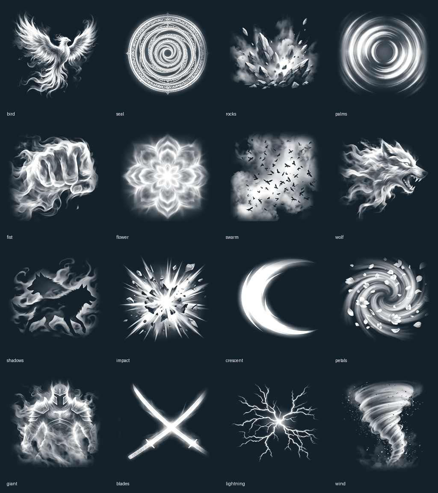

# Lot 0.11 — attaques texturées et laboratoire d’ultimes

Demande du propriétaire : utiliser des images/textures, rendre les attaques moins brèves et ajouter un bouton d’ultime monumental propre à chaque clan, dont la puissance dépend du niveau.

**Sources ajoutées, validation moteur et APK en cours de préparation.** Le lot est regroupé avec le village partagé : aucune APK intermédiaire demandée. Android 6 et 9 ont été retirés par le propriétaire, suppression vérifiée via l’API ; stockage passé de 517 240 603 à **391 410 260 octets**. Android 18 et 19 restent conservés.

## Ce qui est réellement raccordé

- Atlas d’images RGBA de 1024² et seize motifs détaillés, source générée puis inspectée/corrigée. **502 128 octets**, partagé entre tous les effets. Pas d’IA au runtime.
- Katon : flammes animées conservées, impact texturé de près de 2 s. Raiton : branches conservées et prolongées à 0,85 s, résidu électrique texturé jusqu’à 1,8 s. Fūton : vortex texturé de 1,9 s. Doton : roche/poussière texturée de 2,2 s. Frappes : traînée de lames de 0,75 s.
- Les quatre techniques gardent leurs dégâts, coûts, collision et recharges indépendantes. Les images ne déclenchent jamais plusieurs impacts.
- En entraînement solo : **bouton ULTIME**, touche **R** ; **RÉGLER ULTIME** ouvre le laboratoire tactile. Le clan et le niveau de ce laboratoire sont clairement indiqués comme une **simulation hors ligne**, pas l’attribution du compte.
- En village partagé : **DÉFIER EN DUEL**, puis **NIVEAU TEST** avant l’arrivée du deuxième joueur. Les attaques sont envoyées sans dégâts depuis le client ; le serveur transmet ensuite l’action, l’impact ou l’esquive à deux clients.
- Le duel en ligne utilise maintenant un catalogue de **14 clans × 4 techniques particulières**. **Uchiwa est le seul clan Katon** et **Senju le seul clan Mokuton** ; les autres clans ont leurs propres voies (Fūinjutsu, Jūken, Expansion, Esprit, Kikaichū, Bestial, Ombre, Impact, Énergie spirituelle, Jeu d’ombres, Titan ou Lames). Chaque bouton reprend le nom, l’élément et le coût validés par le serveur.
- Les boutons de combat, de mouvement et d’interface utilisent des images générées et versionnées : `game/assets/ui/combat_technique_atlas.png` et `game/assets/ui/control_atlas.png`. Les effets du monde utilisent le même principe d’images texturées ; aucun texte du client ne définit un élément ou des dégâts.
- Concentration **1,4 s**, déchaînement, puis dissipation : **5,8 s au total**. Apparition géante, sigil au sol, fragments orbitaux, élargissement progressif du champ de vision. Pas de stroboscope, secousse imposée, ralentissement global, démembrement ou mort permanente.
- L’impact est unique, évitable en quittant la zone marquée, bloqué par les obstacles et limité à l’adversaire d’entraînement. En cas de KO causé pendant l’ultime, la fin visuelle se déroule avant le menu de manche.

## Valeurs de simulation, pas équilibrage définitif

70 chakra, recharge propre de 60 s. Ni les autres jutsu ni leurs recharges ne sont verrouillés globalement. Changer de clan/niveau est interdit pendant la recharge ; pause ou fermeture du laboratoire ne la remet pas à zéro. Recommencer une manche réinitialise le terrain local comme auparavant.

Niveaux de test 1 à 50 : dégâts `55 + 3 × (niveau − 1)`, rayon de 3 à 5 m, ampleur visuelle bornée. Toutes les variantes ont la même base à niveau égal pour ne pas inventer un avantage de clan non validé. Le disque de préparation indique la zone réelle ; les grandes images autour restent décoratives.

**Il n’existe pas encore de niveau de combat sauvegardé ni d’XP dans le compte.** Le laboratoire hors ligne ne donne donc aucun nouveau niveau réel, récompense, pouvoir avancé ou déblocage. Le village partagé possède maintenant un **duel de test éphémère à deux joueurs** : chacun choisit un niveau de test de 1 à 50 avant le lancement, le serveur calcule la puissance, le chakra, les recharges et le KO, puis détruit l’état en fin de duel. Ce mode ne constitue pas encore la progression persistante ni l’équilibrage final.

## Catalogue proposé

| Clan | Ultime de simulation | Motif principal |
|---|---|---|
| Uchiwa | Envol du brasier | Oiseau de feu |
| Uzumaki | Spirale du grand sceau | Sceau tournoyant |
| Senju | Rempart des mille rocs | Éruption de pierre, **pas de Mokuton automatique** |
| Hyūga | Couronne des paumes | Ondes concentriques |
| Akimichi | Poing du géant | Poing spectral |
| Yamanaka | Floraison de l’esprit | Onde florale |
| Aburame | Nuée d’éclipse | Nuée et poussière |
| Inuzuka | Crocs des deux ombres | Loup de chakra |
| Fushiguro | Procession des ombres | Ombres de loups |
| Itadori | Impact du cœur noir | Déflagration sombre |
| Kurosaki | Croissant spirituel | Lame d’énergie |
| Shunsui | Danse des pétales d’ombre | Vortex de pétales |
| Yeager | Colosse de chakra | Silhouette géante temporaire |
| Ackerman | Lames de l’orage | Lames croisées |

Ce sont des propositions visuelles du prototype, pas une affirmation de techniques canoniques ou de pouvoirs déjà gagnés par les genin. Pas de nouveau clan, Nara, bijū, Sharingan gratuit, pouvoir mental mécanique ou transformation persistante.

## Ressources et contrôles

Source, découpe et empreintes : `art_sources/combat/README.md`, `game/tools/prepare_combat_textures.py`, `game/assets/vfx/combat/manifest.json`. Le résultat généré avait six colonnes et trois rangées ; il a été recadré selon ses vraies cellules, réordonné et détouré avec marges transparentes, pas utilisé comme une image plein écran.

Effets ordinaires : trois sprites chacun et quatorze groupes maximum. Ultime : un seul groupe réservé, sept sprites en Économie / dix en Standard. Profondeur active, atlas partagé, pas de particules GPU ou de lumières ajoutées. **Pas de promesse de FPS sur téléphone avant essai.**

Tests ajoutés : catalogue des quatorze clans, niveaux bornés, refus chakra, impact unique, indépendance des recharges, pause et laboratoire, puissance, sortie de zone, KO avec dissipation, nettoyage, absence de mutation du compte. Captures moteur prévues : ultime en action et laboratoire. Tests Node des empreintes/provenance et de l’isolation également ajoutés.

