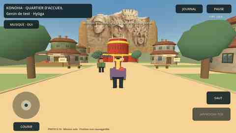
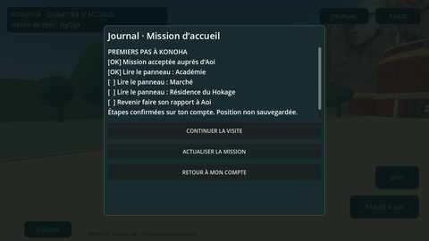
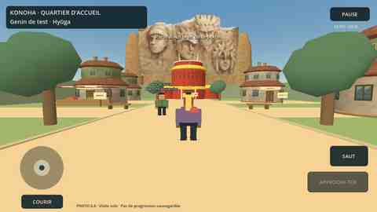

# IDREM ZENKAI — Prototype d’entraînement Android

**Ajout au lot regroupé 0.11 :** attaques enrichies d’images/textures et laboratoire de quatorze ultimes monumentales avec niveau simulé, sans changer les comptes. [Détails et limites](../docs/ULTIMES_ET_TEXTURES.md). Les anciens ZIP Android 6 et 9 sont maintenant supprimés (vérifié), la place nécessaire à la compilation est disponible.

Prototype avec **entraînement solo hors ligne**, **compte connecté** et **premier quartier de Konoha à explorer en solo**. Godot **4.5.1 Standard**, GDScript, rendu Compatibility/OpenGL ES 3. Les personnages restent procéduraux et provisoires. Les nouveaux bâtiments sont construits en code ; leurs surfaces et la falaise utilisent aussi les références fournies par le propriétaire, pas des modèles définitifs du jeu Naruto.

## Sources 0.11 — village partagé, validation moteur à faire

Deux comptes admis peuvent se connecter séparément au même quartier, avec leur nom affiché au-dessus de l’avatar, leur apparence sauvegardée, marche/course/saut et chat de proximité **RP/HRP** via le même serveur HTTPS/WSS. Le bouton **DÉFIER EN DUEL** ouvre un test à deux joueurs : le serveur décide des dégâts, recharges, chakra, niveau de test, ultime clanique, esquive et KO. Reconnexion et départ restent gérés ; le duel est éphémère et aucune progression n’est enregistrée. **43 tests Node, 10 tests PostgreSQL, 2 parcours navigateur et Vite passent.** L’exécution moteur à deux clients Godot et l’APK 0.11 restent à vérifier. [Détails et limites](../docs/VILLAGE_PARTAGE.md).

Le propriétaire confirme **0.10 fonctionnelle sur son téléphone**. Cette version demeure la seule proposée au téléchargement jusqu’à validation complète du lot réseau.

## Lot 0.10 — musique du village et ajouts au site

La musique fournie joue en fond dans Konoha, avec **MUSIQUE : OUI/NON**, le volume général existant, une pause en arrière-plan et un arrêt à la sortie. Le site reçoit la suppression protégée d’un compte accepté et le téléchargement réservé aux admis. **Mettre à jour le service Render existant** pour afficher ces fonctions et le lien 0.10.

**238 assertions Godot**, 31 tests Node, 9 tests PostgreSQL et 2 parcours Playwright réussis. APK debug exporté, signature et permissions vérifiées ; arrivée et journal inspectés. **Fonctionnement sur téléphone ensuite confirmé par le propriétaire.** Le multijoueur n’est pas inclus dans 0.10. [Détails](../docs/AJOUTS_SITE_MUSIQUE.md).

- [ZIP `idrem-zenkai-android-19` — environ 68 Mo](https://github.com/Zorolefrerot/MATCHLY-PROJECT/actions/runs/34601493231/artifacts/10264293080), jusqu’au **18 septembre 2026** ; connexion GitHub nécessaire.
- [Exécution verte](https://github.com/Zorolefrerot/MATCHLY-PROJECT/actions/runs/34601493231). Extraire **`idrem-zenkai-training-debug.apk`**, pas les journaux.
- Même fichier proposé par **Installer IDREM ZENKAI** dans l’espace des joueurs acceptés après déploiement du site.



## Lot 0.9 conservé — première mission, journal et sauvegarde

Une seule version réunit le lot demandé : **accepter la mission auprès d’Aoi → lire/valider trois panneaux → remettre son rapport**, avec journal défilant et étapes sauvegardées sur le compte. Les étapes ne sont cochées qu’après confirmation serveur ; coupure/conflit → actualisation, pas de fausse sauvegarde locale. Aucun objet, ryō, expérience ou pouvoir accordé.

**Mettre à jour le service Render existant avant l’essai : Manual Deploy → Deploy latest commit, puis attendre Live.** Même branche, mêmes secrets, migration additive au démarrage. Le mode d’exploration reste utilisable sur un ancien serveur, mais les missions y sont explicitement indisponibles. [Parcours, contrat et limites](../docs/MISSION_ACCUEIL.md).

## Historique de validation 0.9

**Version 0.9.0 compilée le 10 septembre 2026.** **231 assertions Godot**, 28 tests Node, 8 tests PostgreSQL, export signé et permissions vérifiés. Journal et incident réseau inspectés sur captures ordinateur ; **le propriétaire a ensuite confirmé que la mission et sa reprise fonctionnent sur son téléphone**. Détails : [`VALIDATION.md`](VALIDATION.md).

- [ZIP `idrem-zenkai-android-18` (environ 67 Mo)](https://github.com/Zorolefrerot/MATCHLY-PROJECT/actions/runs/34474189586/artifacts/10150821501) — connexion GitHub nécessaire, disponible jusqu’au **17 septembre 2026**.
- [Exécution verte](https://github.com/Zorolefrerot/MATCHLY-PROJECT/actions/runs/34474189586).
- Extraire et ouvrir **`idrem-zenkai-training-debug.apk`**. `godot-test-logs-18` contient seulement les journaux.



## Décor 0.8.0 conservé — Konoha moins cubique

- Quatre maisons réellement arrondies, étages en retrait, toits courbes débordants, fenêtres et cheminées ; murs fermés avec collisions convexes adaptées.
- Résidence circulaire rouge et or, ailes basses, corniches, porche et emblème inspirés de l’image fournie.
- **Quatre premiers visages** de la falaise, pour correspondre à l’image de la résidence ; l’original à sept visages est conservé. Décor texturé fixe derrière des volumes rocheux, **pas des visages sculptés en 3D**.
- Sept textures légères préparées depuis les trois références, mipmaps, matériaux partagés, fenêtres/portes réunies en un maillage. Pas de promesse de détails HD à partir de ces petites images.
- Compte, avatar distant, contrôles, Aoi, panneaux, retour sûr et entraînement séparé conservés. La retouche 0.8 seule ne demandait pas de déploiement Render ; la mission 0.9 ci-dessus en demande un.



Sources, méthode et limites : [`assets/konoha/README.md`](assets/konoha/README.md).

## Parcours 0.7.0 conservé — première zone de Konoha

- **MON COMPTE → connexion → ENTRER À KONOHA · PREMIÈRE ZONE SOLO**. Entrée distincte du retour à l’entraînement, avec nouvelle vérification de la session et chargement de l’apparence du compte.
- Porte d’arrivée, allée principale, marché, académie, maisons et résidence du Hokage. Scène et monde physique séparés de l’arène ; ne réutilise pas sa carte sous un autre nom.
- Joystick/caméra tactiles, marche, course et saut. **Aoi**, guide original, accueille les genin ; trois panneaux permettent de repérer les lieux.
- **Pause → RETOUR À MON COMPTE** pour sortir. Dialogues écrits ; aucun jutsu de test dans ce quartier. L’entraînement reste inchangé et utilisable séparément.
- Visite **solo**, bâtiments extérieurs seulement. Pas d’autres joueurs, d’achats ou de récompenses. Position temporaire ; étapes de mission désormais sauvegardées par le lot 0.9, apparence sauvegardée par le créateur.
- Le quartier 0.7 initial utilisait l’API 0.6 ; les nouvelles étapes sauvegardées de 0.9 nécessitent la mise à jour serveur indiquée plus haut. Modèles encore provisoires.

Détails, contrôles et limites : [première zone de Konoha](../docs/KONOHA_PREMIERE_ZONE.md).

## Compte 0.6 conservé — identité et apparence sur le serveur

- Bouton **MON COMPTE** à l’accueil/pause. Connexion par l’adresse HTTPS exacte du site et les identifiants d’un joueur admis. Le compte administrateur n’est pas un personnage joueur.
- Nom, clan, affinité et potentiel Mokuton lus depuis les attributions existantes, **sans relancer le tirage**. Genin à Konoha pour cet incrément, sans progression persistante de combat.
- **MODIFIER L’APPARENCE → ENREGISTRER SUR MON COMPTE** sauvegarde sur le serveur. Retrouver les choix après reconnexion/réinstallation. Un conflit n’écrase pas une version plus récente.
- Mot de passe et jeton seulement en mémoire ; session 2 h, nouvelle connexion invalidant la précédente. Seule l’origine publique du serveur est mémorisée. Pas de secret Neon dans l’APK.
- **APPARENCE HORS LIGNE** garde une sauvegarde distincte, sans requête réseau. Les choix du compte ne remplacent pas le combattant local ni ses quatre techniques de test.
- Une réinstallation efface les choix **locaux** des versions précédentes, qui ne sont pas automatiquement transférés sur le compte. Les modèles, sons et combats validés sont conservés. Affichage **PROTO 0.6**.

**Activation, API et limites : [Compte du jeu](../docs/COMPTE_JEU.md).** Compte et mission 0.9 confirmés par le propriétaire ; déploiement des ajouts site 0.10 encore à effectuer, sans vérification indépendante de la production par l’agent. Le quartier conserve la mission personnelle, mais sa présence partagée et son duel réseau restent un mode de test limité à deux joueurs admis ; ce n’est pas encore le serveur RP complet.

## Créateur 0.5 conservé — apparence hors ligne

Depuis l’accueil ou la pause, choisir **APPARENCE HORS LIGNE** pour les choix locaux, ou utiliser le créateur depuis **MON COMPTE** pour la sauvegarde distante.

- **2 modèles** : masculin ou féminin, au choix ; mêmes collisions, santé et capacités. Les tenues conviennent aux deux silhouettes.
- **4 coiffures** (court, pointes, carré, queue de cheval), **8 couleurs de cheveux**, **6 couleurs d’yeux**, **6 teintes de peau**.
- **3 hauts**, **3 bas**, **8 couleurs indépendantes** pour chaque partie. **4 ensembles** permettent d’appliquer un haut et un bas coordonnés, puis de les modifier séparément sans toucher au visage ou aux cheveux.
- Aperçu 3D pivotant au doigt ou avec les boutons. **Visage / corps** rapproche la caméra pour les couleurs des yeux et les détails de la coiffure. Faire défiler les réglages pour atteindre **Tenue complète**.
- **Enregistrer l’apparence** applique les choix au combattant et les écrit localement. Ils sont rechargés au lancement suivant et conservés après une nouvelle manche. **Annuler** ou Retour abandonne le brouillon.
- Écriture temporaire puis remplacement du fichier ; en cas d’échec, le brouillon reste ouvert et les anciens choix ne sont pas appliqués/écrasés. Les données invalides reviennent aux valeurs par défaut.
- Le combat reste en pause pendant la création. L’aperçu possède un rendu séparé **désactivé quand le créateur est fermé**.

**Limites importantes :** modèles procéduraux encore provisoires, pas des avatars anime définitifs. Choix locaux dans `user://appearance-v1.json`, sans compte ni synchronisation entre appareils. **Désinstaller le prototype ou effacer ses données supprime cette apparence.** Les clés de signature debug changent entre compilations : une future mise à jour peut nécessiter une désinstallation, donc une nouvelle personnalisation. Aucun équipement/statistique/clan/dōjutsu n’est accordé par ces choix cosmétiques. Aucun son, jutsu ni paramètre de combat n’a changé.

## Effets 0.4.0 conservés — feu et foudre

- **Katon** : boule de feu à silhouette plus large, flammes orange/jaune animées, cœur clair, courte traînée de flammes et embrasement à l’impact. La sphère opaque provisoire a été retirée.
- **Raiton** : cœur blanc, canal cyan et halo bleu ; branches et arcs autour de la main et du point atteint, trois formes successives puis disparition rapide.
- Texture de feu originale et partagée ; éclair regroupé en trois maillages. Pas de lumière dynamique, d’effet plein écran ou de secousse de caméra ; plafond des groupes secondaires conservé à 14.
- **Sons fournis, warning, règles de combat, Fūton et Doton inchangés.** Aucune modification du site ni des comptes.
- L’étape d’entraînement a été validée par le propriétaire avant de commencer la création de personnage.

Détails et génération reproductible : [`assets/vfx/README.md`](assets/vfx/README.md).

## Enregistrements de la version 0.3.0 conservés

- Les **neuf fichiers fournis** dans le dépôt remplacent les sons provisoires : Katon, Raiton, Fūton, Doton, impact de terre, frappe, coup reçu, esquive et musique de combat.
- Signal **warning original** conservé par l’agent : 0,12 s, légèrement mis en avant pour annoncer l’attaque ennemie.
- Volumes harmonisés, suppression des silences extérieurs et fondus courts. La durée audible des enregistrements est conservée, sans changement de hauteur. La musique préparée dure environ **41,51 secondes** et boucle en arrière-plan.
- Un effet identique déjà en cours est redémarré à la nouvelle action : les enregistrements longs ne s’empilent pas à chaque frappe. Les techniques gardent leurs coûts, dégâts et recharges.
- Les fichiers **melee** et **dodge** fournis sont identiques ; ces deux associations sont conservées.
- Sources exactes préservées dans `game/audio_sources/`, hors de l’APK. Malgré leur extension `.mp3`, il s’agit d’AAC/MP4 : ils ont été réellement décodés en WAV, pas seulement renommés.

Détails, empreintes et conversion reproductible : [`assets/audio/README.md`](assets/audio/README.md). Les droits des enregistrements fournis n’ont pas été vérifiés ; ils ne sont pas revendiqués comme des créations originales de l’agent.

## Améliorations de la version 0.2.0 conservées

- **Logo retiré de l’interface de combat** : aucun `TextureRect` ni image de logo ne peut couvrir la vue. L’icône Android est conservée.
- **Course ninja** : bras en arrière, légère inclinaison du personnage, transitions vers l’arrêt ; le bras de frappe revient vers l’avant même en course. Pose visuelle uniquement, sans modification des dégâts ni des vitesses.
- **Effets plus lisibles** : traînée et étincelles de feu, éclair en zigzag, anneaux de vent, pierres surgissant du sol, arc de frappe et impacts. Effets 3D courts, sans flash plein écran ni secousse de caméra, maximum 14 groupes simultanés ; densité réduite en Économie.
- **Lecture audio hors ligne** : effets par action, avertissement et ambiance. Les sons provisoires originaux de 0.2.0 sont remplacés par les enregistrements fournis dans 0.3.0, sauf le warning.
- **Pause → Volume général** (0 = silence) et **Ambiance de combat** (activation indépendante). Limiteur contre la saturation, 8 voix d’effets maximum, une seule piste de fond ; silence à l’accueil, en pause et au résultat. Réglages conservés pour la session, pas après fermeture.

La lecture audio est couverte par les tests du moteur, mais son rendu sur les haut-parleurs du téléphone et l’impact des nouveaux effets sur les FPS restent à confirmer par le propriétaire.

## Contenu

- Petite arène 3D fermée avec collisions, décor de village stylisé et personnages articulés provisoires.
- Déplacements relatifs à la caméra, course, saut et esquive avec courte protection.
- Joystick tactile à gauche ; glissement à droite pour orienter la caméra ; plusieurs doigts peuvent déplacer, viser et lancer des techniques simultanément.
- Verrouillage optionnel de l’adversaire. DOTON reste une zone visée manuellement au sol.
- Quatre techniques de test : KATON (projectile), RAITON (rayon), FŪTON (cône et recul), DOTON (onde de zone après avertissement).
- Chakra, régénération automatique ralentie en combat et recharges indépendantes.
- Adversaire à logique programmée : patrouille, poursuite, cercle rouge de préparation, frappe. Peut être désactivé depuis la pause.
- Écrans d’accueil, pause, victoire/défaite, relance de manche et deux réglages graphiques.

**Ce n’est pas encore le jeu RP multijoueur.** L’espace de compte lit l’identité du site et enregistre son apparence et les étapes de la mission d’accueil. L’entraînement n’enregistre aucun clan, rang, inventaire, tirage, récompense ou progression. Le mélange de quatre éléments sert seulement à tester les mécaniques. Il ne remplace pas les règles d’affinité validées pour le jeu final.

## Téléphone Android

Cible de test conseillée : Android **8+**, CPU ARM64 ou ARMv7, OpenGL ES 3, orientation paysage. Le manifeste compilé fixe le minimum technique à Android **7 (API 24)** et cible Android **15 (API 35)** ; ce sont les valeurs intégrées au modèle standard, pas des garanties de compatibilité matérielle. La compatibilité et les performances réelles doivent être vérifiées sur les téléphones des testeurs. La version 0.6 demande la permission **INTERNET** pour le compte. Aucun accès localisation, caméra, micro, contacts ou stockage externe n’est demandé.

La compilation GitHub vérifie la signature de l’APK et ses permissions. Une compilation réussie n’équivaut pas à un essai sur un téléphone physique.

### Compilation activée — aucune nouvelle configuration nécessaire

Le propriétaire a ajouté `.github/workflows/android-prototype.yml` depuis GitHub sur **`arena/01a08158-matchly-project`**, commit `8af7056`. Le modèle reste dans [`ci/android-prototype.yml`](ci/android-prototype.yml). Il ne faut **pas recréer le fichier**.

La connexion Arena ne peut toujours pas modifier les workflows eux-mêmes, mais les changements du jeu sur cette branche déclenchent la compilation existante. Aucun réglage Render/Neon n’est requis pour compiler. Le compte connecté nécessite le déploiement du nouveau serveur, sans nouvelle variable secrète. Le bouton `Run workflow` peut rester absent tant que le workflow n’est pas sur la branche par défaut ; une exécution existante peut être relancée avec **Re-run jobs**.

### Récupérer une compilation depuis GitHub, une fois verte

1. Ouvrir le dépôt `Zorolefrerot/MATCHLY-PROJECT` dans GitHub, puis **Actions**.
2. Choisir **Android - Prototype IDREM ZENKAI** et une exécution **verte** correspondant à la version du jeu souhaitée sur `arena/01a08158-matchly-project`. Une mise à jour de documentation seule peut ne pas créer de nouvelle APK.
3. Dans **Artifacts**, télécharger `idrem-zenkai-android-…` (connexion à GitHub nécessaire).
4. Extraire le ZIP sur le téléphone et ouvrir `idrem-zenkai-training-debug.apk`.
5. Les clés de test changent entre compilations : **désinstaller l’ancien prototype avant d’installer la version 0.10.0** si Android refuse la mise à jour. Cela ne supprime aucun compte du site. Si Android demande une autorisation d’installation depuis le navigateur/gestionnaire de fichiers, ne l’accorder qu’à cette application de confiance et la retirer après installation. Ne pas désactiver les protections globales du téléphone.
6. Garder les graphismes **Économie** pour le premier essai.

L’APK est signé avec une **clé de test temporaire**, pas une clé Play Store. Une nouvelle exécution peut générer une signature différente : Android pourra demander de désinstaller le prototype précédent avant installation. Le paquet `org.idremzenkai.training` est distinct du futur jeu. Aucun compte ni candidature n’est supprimé en désinstallant ce prototype.

Les artefacts expirent après **7 jours**. Le workflow se lance uniquement lors d’un changement de `game/` ou de son propre fichier sur notre branche, pas lors des changements du site. Il utilise un runner GitHub standard et aucun secret de Render ou Neon. Le dépôt est public au moment de la préparation ; vérifier les conditions et quotas GitHub si sa visibilité change. Aucun runner premium ni abonnement n’est configuré.

**Limites gratuites vérifiées dans la [documentation GitHub Actions](https://docs.github.com/en/billing/concepts/product-billing/github-actions)** : l’exécution sur runners standards est gratuite pour les dépôts publics. GitHub Free annonce notamment **500 Mo d’artefacts partagés avec Packages** ; pour les dépôts privés, **2 000 minutes/mois** sont incluses. Le stockage et les règles peuvent évoluer : surveiller **Settings → Billing and licensing** du compte, télécharger les APK utiles puis supprimer les anciens artefacts, et ne pas activer de dépassement payant. Si un moyen de paiement existe déjà sur le compte, vérifier le budget avec blocage des dépassements ; le projet ne modifie pas ces paramètres. Sans moyen de paiement valide, GitHub indique bloquer l’usage concerné après épuisement du quota. Les SDK/modèles volumineux ne sont pas conservés en artefacts.

Le bouton **Run workflow** peut ne pas apparaître tant que le workflow n’est pas dans la branche par défaut. Dans cette session nous travaillons uniquement sur `arena/01a08158-matchly-project` : utiliser une exécution déclenchée par un commit de cette branche, puis **Re-run jobs** si une nouvelle compilation identique est nécessaire. Ne pas changer de branche uniquement pour contourner cela.

## Sur ordinateur

Ouvrir `game/project.godot` avec Godot 4.5.1 Standard, puis F6/F5 pour lancer la scène/projet.

| Action | Commande |
|---|---|
| Déplacement | ZQSD / WASD / flèches |
| Caméra | Clic droit maintenu + glisser |
| Course | Maj |
| Saut | Espace |
| Esquive | Ctrl ou X |
| Frappe | F ou clic gauche hors interface |
| Techniques | 1, 2, 3, 4 |
| Cible | Tab |
| Pause | Échap |

Le bouton Retour Android ouvre la pause. Une perte de focus met le combat en pause et annule les entrées tactiles, pour ne pas laisser courir le personnage pendant une interruption.

## Compilation et tests

Godot et les modèles d’export officiels sont téléchargés par `tools/install_engine.sh`, puis vérifiés avec des SHA-256 fixés pour cette version. Ils ne sont ni ajoutés au dépôt ni installés sur Render.

```bash
# Depuis la racine du dépôt
export GODOT_BIN=/chemin/vers/godot
bash game/tools/check.sh
# JDK 17 + SDK Android API/build-tools 35 installés et variables configurées :
export JAVA_HOME=/chemin/vers/jdk17
export ANDROID_HOME=/chemin/vers/android-sdk
bash game/tools/export_android.sh
```

Le script d’export utilise automatiquement un dossier XDG temporaire dédié : il ne remplace pas les préférences personnelles de l’éditeur Godot. Aucun SDK NDK ni compilation de moteur n’est requis ici : le projet utilise les modèles APK standards, sans Gradle ni plugin natif. Les champs `gradle_build/min_sdk` et `target_sdk` doivent rester vides avec ces modèles standards. `rendering/textures/vram_compression/import_etc2_astc=true` est nécessaire pour préparer l’export mobile depuis Linux.

- `tests/smoke.gd` : règles, collisions, mouvement, sauts, esquive, pause, cible, projectile, victoire et réinitialisation.
- `tests/capture.gd` : captures de l’arène, de la course ninja, des quatre techniques et du menu ordinateur, pas des preuves d’exécution Android.
- `tools/prepare_audio.py` : conversion des neuf fichiers fournis (FFmpeg 7.x) avec manifeste des sources, durées et gains.
- `tools/generate_audio.py` : génération du **warning seulement** (Python standard). Ce script ne remplace plus les enregistrements fournis. Tests Node des empreintes, PCM, niveaux et raccord de boucle.
- Les logs disponibles sont conservés dans les artefacts GitHub même si une étape échoue. Les captures ne sont produites qu’après les tests et l’export réussis.

## Essai à réaliser par le propriétaire

Noter le modèle du téléphone et la version Android. Vérifier : installation, lancement, joystick + technique en même temps, caméra, saut, collisions des murs, chakra et recharges, esquive du cercle rouge, pause/reprise après changement d’application, victoire/défaite et rejouer. Observer les FPS en Économie, puis Standard ; signaler chauffe, chute de fluidité ou fermeture inattendue.

## Ce qui vient après

Corriger les retours de prise en main/performance, préparer des vrais modèles et animations sous licences appropriées, puis seulement tester la synchronisation de **deux joueurs** et une mission coopérative. L’authentification, les permissions et les récompenses du vrai jeu devront rester contrôlées par un serveur autoritaire ; ce prototype local ne doit pas être connecté tel quel aux récompenses de production.

## Ressources et licences

Godot : licence MIT (<https://godotengine.org/license/>). Les textes de licence du moteur et de ses composants sont inclus dans `THIRD_PARTY_NOTICES.txt`, également embarqué dans l’export. Personnages et décor : géométrie originale créée pour ce prototype. Icône : image fournie dans le dépôt par le propriétaire ; les droits sur l’univers et l’illustration restent à vérifier avant diffusion publique. Les modèles et animations restent procéduraux. Les enregistrements de la version 0.3.0 ont été fournis par le propriétaire ; leur provenance artistique et leurs droits sont à vérifier avant diffusion publique.
